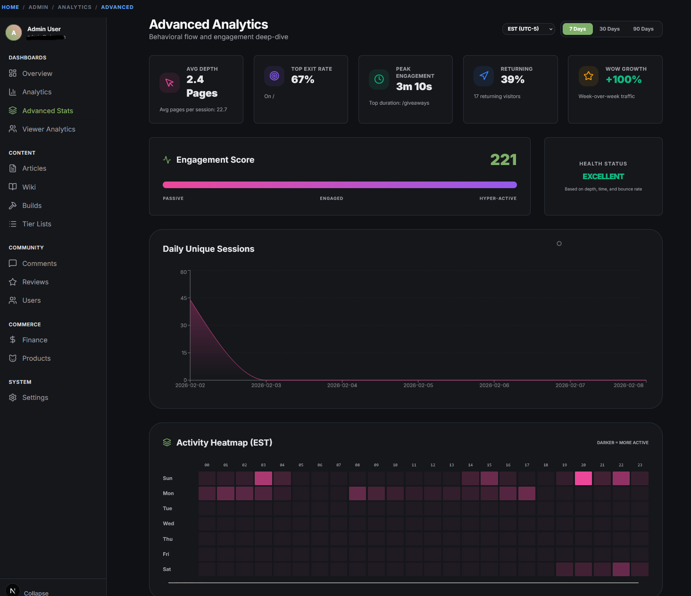

# Preview

A content platform built with **Next.js** and deployed on **Vercel**, featuring a custom admin dashboard for real-time analytics and content management.

---

## Admin Dashboard

The admin dashboard provides a centralized interface for managing content, monitoring site performance, and tracking user engagement across multiple content verticals.

### Dashboard Overview

### Analytics Dashboard

### User Analytics

### Advanced Analytics

---

## Tech Stack

| Layer | Technology |
|-------|-----------|
| **Framework** | Next.js |
| **Frontend** | React |
| **Deployment** | Vercel |

---

## Features

- **Admin Dashboard** — Real-time analytics, content performance tracking, and user management
- **Content Platform** — Multi-category content delivery across gaming, finance, and lifestyle verticals
- **User Analytics** — Real-time visitor tracking, engagement metrics, and traffic source breakdown
- **Data Visualization** — Interactive charts and metrics for monitoring site engagement
